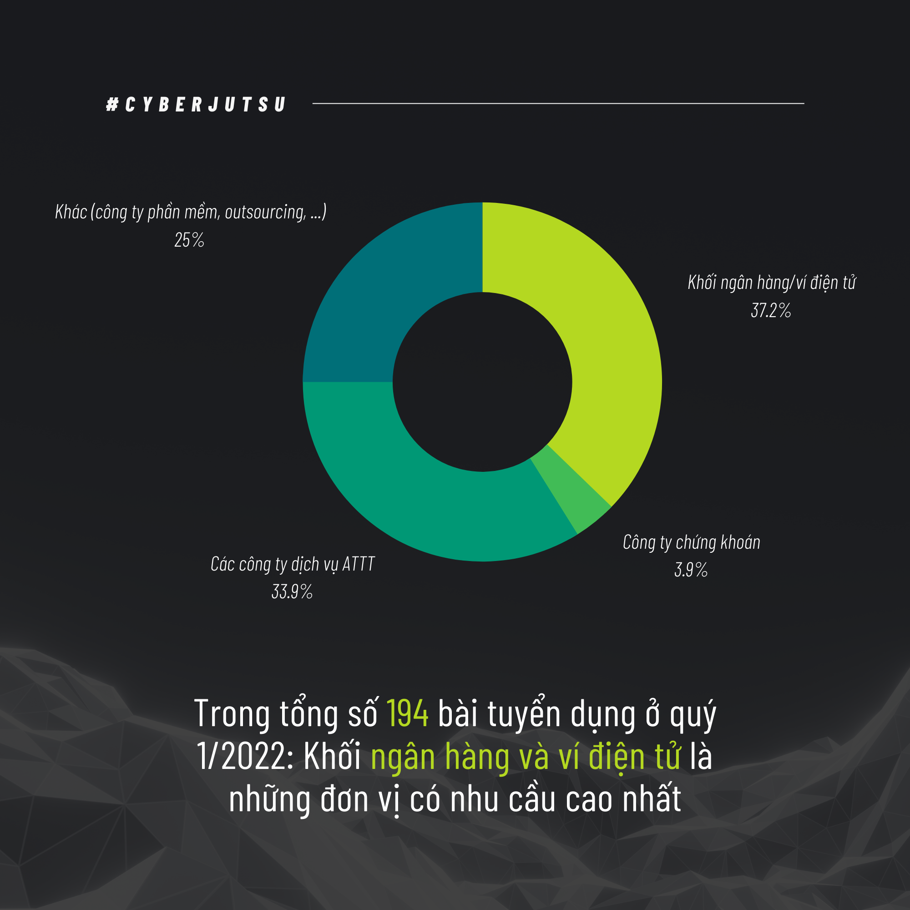
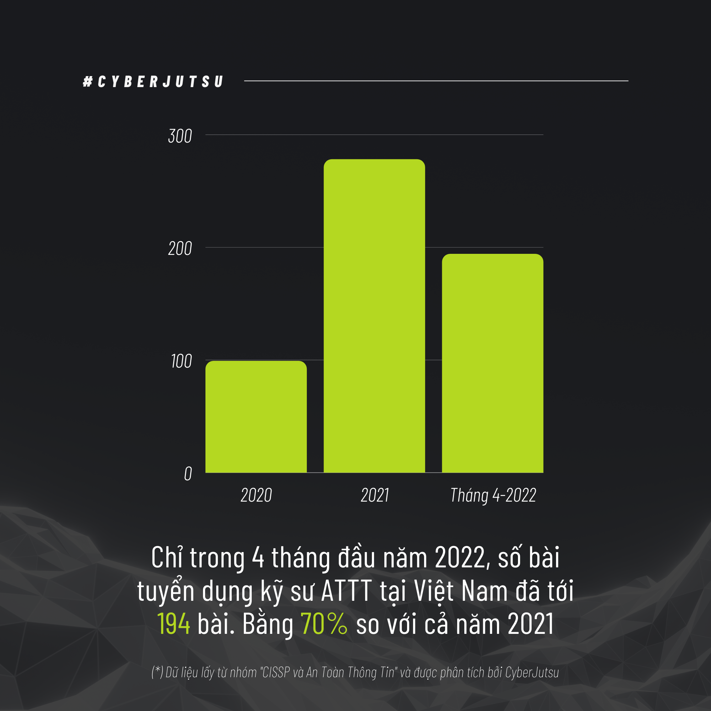
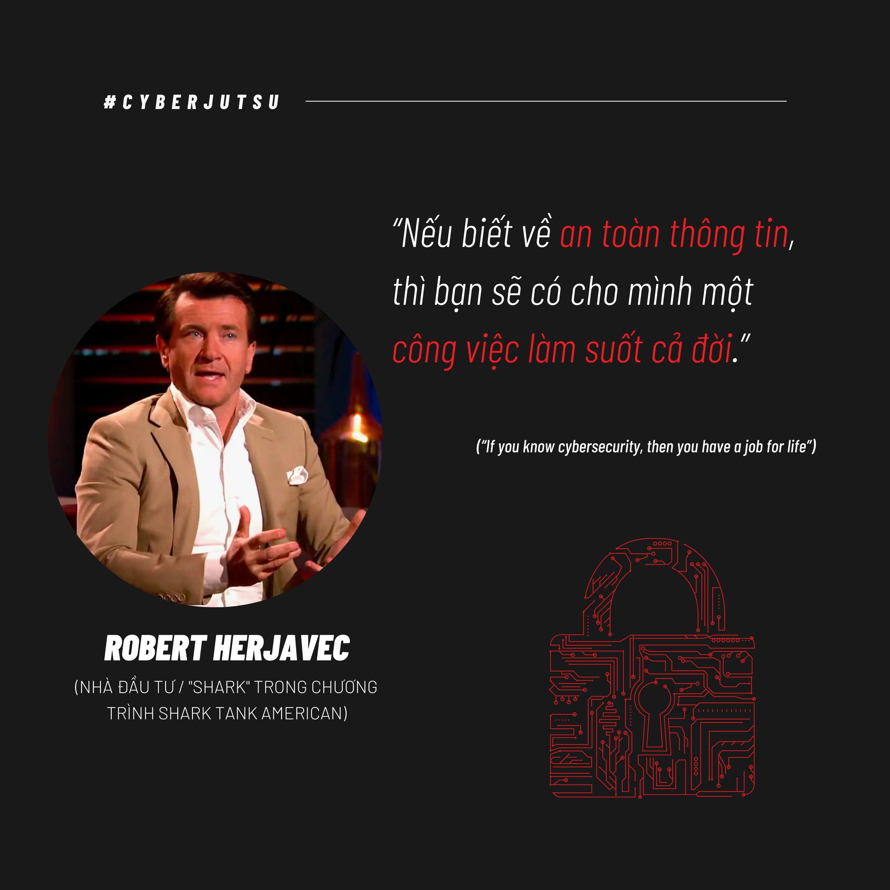

# Chênh vênh giữa tuổi 20 (phần 1)


This article shows the my feeling after bad mood.

<!--more-->

# 1 . Tiểu sử

Dạo gần đây tôi cảm thấy khá bế tắc trong học tập cũng như trong cuộc sống. Sau buổi phỏng vấn (thực ra đúng hơn là nói chuyện và tâm sự, chứ nếu hỏi về chuyên môn thì kiến thức của mình gần như bằng 0) với các anh ở một công ty mà tôi xin phép được giấu tên (công ty này là một công ty đứng đằng sau các công nghệ mà các bank (ngân hàng) ở Việt Nam cũng như một số bank giáp Việt Nam đang sử dụng dịch vụ) để bảo đảm danh tính thậm chí là công việc của chính bản thân mình, thì tôi vừa mới có một con đường để đi tiếp (thật ra cũng chẳng mới mẻ gì), đó là vẫn tiếp tục học và trau dồi thật nhiều kiến thức và kĩ năng chuyên môn về an toàn thông tin cũng như trau dồi kĩ năng ngoại ngữ cũng như kĩ năng mềm, nâng cao thể chất của bản thân.

# 2. Giới thiệu

Dạo gần đây chắc mọi người cũng biết do tình hình kinh tế thế giới đang gặp khó khăn, giá cả vật chất leo thang đỉnh điểm, cũng như một loạt làn sóng sa thải nhân sự ở các công ty công nghệ lớn trên thế giới như Google, Facebook, Microsoft, OpenAI,… và tình hình trong nước ở Việt Nam cũng không phải ngoại lệ. Tất nhiên là những ngừoi có năng lực thật sự thì hầu như không quá bị ảnh hưởng bởi vấn đề trên. Tuy nhiên, vẫn có một vài trường hợp theo sự chứng kiến của tôi (trên báo, ngoaì đời) thì cũng đã bị một tràng sa thải không thông báo chính thức mặc dù là một người làm việc chính thức trên 5 năm kinh nghiệm (hay còn gọi là senior theo ngôn ngữ các nhà HR (Human Resource) hay đăng tuyển dụng tuyển ngừoi). Ngoài ra, cũng đang có một sự bất cập khấc đó là các nhà tuyển dụng tuyển intern cũng căng hơn theo nghĩa đen, tức là yêu cầu nhiều kỹ năng khác nhau (kỹ năng đó nói thật lòng lớp tôi 45 đứa thì may ra được 5 đứa).

# 3. Chi tiết việc học hành, một sinh viên An toàn thông tin cần phải học những gì ? Và tôi vẫn đang vận lộn với chúng

Nói thật là nhiều lắm có khi cả đời chả nắm được hết những thứ cơ bản được hết. Chuyên ngành ư ? Thôi xin nói thật ở cái lĩnh vực này, không có cái gì là chuyên ngành cả, nói thật, cứ giả dụ giờ có một ngừoi là có năng lực trình độ đứng số 1 thế giới về An toàn thông tin đi, thì hắn/anh/chị ấy cũng phải liên tục học hỏi, trau dồi các kiến thức mới để có thể theo kịp được tốc độ phát triển kinh hoàng của lĩnh vực công nghệ thông tin hiện nay. Thế nên nếu ai hỏi tôi (gia đình, bạn bè, ngừoi thân,…) mà hỏi câu đấy thì làm ơn là không nên hỏi câu đấy đối với tôi, vì tôi cảm thấy hơi áp lực (có thể mọi người nghĩ “Ui!! Hỏi thế mà đã áp lực rồi” nhưng thưa đấy là với người ngoài chứ thực chất chỉ có người trong cuộc học cái này mới hiểu, người ngoài có ở gầm giường soi mình cả ngày đâu mà biết mình học tập và làm việc thế nào).

Còn cụ thể các bạn muốn biết tôi học những gì để làm trùm cái ngành này thì đây: Có ba món quan trọng cần phải học: lập trình, lập trình và lập trình! Để làm việc được trong ngành này, bạn phải yêu thích lập trình. Không có cách nào khác. Thề luôn! (Cá nhân tôi là người lập trình tệ phải nói thật là như vậy, tôi phải học cải thiện môn này thì điểm mới khá hơn cơ mà, mà lúc thi cuối kỳ khi học cải cảm giác chả khác gì lần 1, chả qua do cách tính điểm lại khác với do thời thế nên điểm mới khả quan hơn). Rõ ràng muốn tìm lỗi của phần mềm thì bạn phải hiểu được phần mềm thông qua mã nguồn trực tiếp hay trung gian của nó. Rất có thể bạn sẽ không phải lập trình hàng ngày, nhưng bạn phải viết được những công cụ nhỏ hay những thư viện hỗ trợ cho công việc và các lập trình viên khác.

Nhưng mà lập trình bằng ngôn ngữ gì bây giờ? Đây là câu hỏi dễ làm cho các lập trình viên oánh nhau nhất. Cá nhân tôi thấy rằng người làm an toàn thông tin bây giờ cần phải thông thạo C, x86 Assembly, Python và JavaScript, tất nhiên còn một số đống khác, nhưng đó là khá điển hình (thú thật với các bạn trường tôi nó sắp xếp hơi buồn cười, lẽ ra ngành tôi nên học C thay vì Python để hiểu rõ bản chất từng dòng code hơn, nhưng không lại đi cho học cùng với bọn Data Science & AI và học C không có môn trong chương trình đào tạo nên tôi phải tự bơi theo đúng nghĩa đen). Trong quá trình học khá là chật vật vì nhìn khá lú và cảm giác tương đối khó khăn khi bị ngược tư duy so với Python.

Thôi đi thẳng vào vấn đề, học những gì: Theo tôi đã và đang học và tiếp tục tự học bên ngoài thì sẽ tự học các vấn đề sau đây:

- Các kiến thức chung mà ngành IT nào cũng học qua:
    - Những môn tôi đã học:

    Nhập môn Lập trình, Cấu trúc Dữ Liệu và Giải Thuật, Toán rời rạc (kì này đang cải thiện), Cơ sở dữ liêu, Lập trình hướng đối tượng, Kiến Trúc Máy Tính (kì này đang cải thiện)
    - Những môn tôi kì này đang học (thề khó nhai lắm)

    Nhập Môn An Toàn Thông Tin, Hệ Điều Hành, Mạng Máy Tính

    Ngoài ra, kì này tôi còn học một số môn mà tôi thấy khá quan trọng trong ATTT mà chương trinh đào tạo đã gợi ý là: Phát triển ứng dụng trên thiết bị di động, Hệ thống xác thực Sinh Trắc học. Những môn này OK về bề ngoài nhưng tôi sẽ bóc phốt ở phần sau.
    - Ngoài ra còn một số môn mà tôi sẽ phải học và những môn đó tôi nghĩ là cần thiết với ATTT

    Lập trình hệ thống, Mật mã ứng dụng, An ninh Mạng (Nên nhớ An ninh mạng khác Nhập môn ATTT, đại khái An ninh mạng là liên quan về mạng máy tính nhiều, còn cái kia sẽ giới thiệu ATTT và liên quan tới các thuật toán mật mã hóa nhiều, thế là tôi có tận 2 môn chuyên hẳn về mật mã hóa, khá là đau đầu vì tương đối nhiều toán và tư duy nhiều), Phát triển ứng dụng Web an toàn, Điều tra số, An toàn phần mềm, Phân tích mã độc, Phòng chống tấn công mạng, Kiểm thử xâm nhập.

Còn nhiều môn khác cơ sở ngành cũng như chuyên ngành mà tôi cũng chưa được học nhưng tôi nghĩ những cái kia trường dạy là quan trọng nhất.

Ngoài ra, vì trong chương trình khả năng cao không có môn Reverse Engineering (Kỹ thuật đảo ngược) nên tôi cũng phải tự bơi, tức tự học thêm trên Internet !!!

# 4. Bóc phốt

Tất nhiên nghe bóc phốt có vẻ hơi quá nhưng thực sự các môn mà cần rất nhiều đầu tư về mặt thời gian và công sức như các môn chuyên ngành (như kì này tôi đang học là phát triển ứng dụng trên thiết bị di động, Hệ thống xác thực sinh trắc học) thì tín lại ít hơn đáng kể so với các môn cơ sở và cốt lõi ngành ???(1 môn chuyên ngành chỉ có 2 tín môn cơ sở ngành 3 tín, tức thời gian học 3 tín sẽ nhiều hơn 2 tín rồi) (chuyên ngành ở đây là do trường định nghĩa, chứ với bản thân tôi thì môn nào cũng chỉ là cơ bản cả, sau này còn nhiều thứ khác phức tạp hơn nhiều). Tất nhiên tôi hiểu là Đại học chỉ là cái sườn dạy các khái niệm cơ bản, còn muốn chuyên sâu các thứ thì phải tự học ở ngoài, tự bơi không ai mớm sẵn cho mình ăn cả. Tuy nhiên thì cảm giác những môn đó dạy rất là nhanh (ví dụ bên Data Science & AI có môn thị giác máy tính dạy trong hẳn 1 kì cơ mà nhưng đây môn Hệ thống xác thực sinh trắc học lấy kiến thức từ môn đó và dạy trong vòng có 6 tuần, tất nhiên mấy tuần còn lại có chuyên đề riêng khác, nhưng 6 < 16 tuần cơ mà nên cảm giác không thể ngấm hết được, tất nhiên một phần cũng là do tôi kém), nên nhiều khi cảm giác rất hổng các kiến thức cơ bản (tất nhiên cái này cũng là do tôi kém vì tự học hỏi nhiều trên Internet chưa đủ.), nên là chuyên môn chưa được vững (các anh lúc phỏng vấn nói không sai khi bảo tôi “Lỗ hổng kiến thức hay kỹ năng lẫn phương pháp luận (methodology) của em ở tuổi em thì nhiều vô kể, học ở trường cũng không bù đắp được. Nên mới cần internship”)

# 5. Những khó khăn và sự mệt mỏi

Khó khăn ư:
```
    Khó khăn về nhiều kiến thức hơn so với cấp 3 là rõ, vì môi trường trong lớp đứa nào mà chả giỏi, giải này giải kia, tôi nhớ kì học online năm nhất, học một môn IELTS mà đứa bên Data Science & AI đã hỏi một câu là học chuyên gì cơ mà. Còn nữa bây giờ AI đang nổi đang thịnh hành, nên ngoài học về ATTT đại khái là ở kì này thì tôi còn phải học thêm cả AI nữa để có thể dùng các công nghệ như deepfake, … (khá rủi nhưng cũng khá may là tôi được học cùng bọn đó nên kỹ năng đó nếu mà nói thì cũng được 70-80% so với bọn AI, các năm trước thì mọi người gần như chỉ học về ATTT thôi mà giờ ôm thêm cả AI nữa thì khá là đau đầu, vì AI nếu so với ATTT thì 1 cái 9, 1 cái 10 rồi, thế nên các bạn mới thấy ngành Data Science & AI 100 người học nhưng chắc 85-90 ông theo Data Science vì học AI nó cần phải đầu to lắm, cần rất nhiều toán và khả năng tư duy.). Ngoài ra còn phải thành thạo máy tính do hồi cấp 3 chả có cái gì chuyên cả, ngoài ra nhiều lúc tôi cũng muốn nâng cao ngoại ngữ cũng như kỹ năng giao tiếp của bản thân nhưng do kiến thức chuyên môn quá nhiều nên tôi chưa biết sắp xếp thời gian như thế nào cho hợp lí cả. Học ngoại ngữ trông thế thôi chứ muốn lên trình nhanh với bền vững một ngày cũng phải dành ít nhất 3 tiếng là ít và thời gian đó là khá nhiều, hy vọng thời gian tới tôi có thể sắp xếp được.
    Khó khăn thứ hai là xa nhà, cuộc sống tự lập khiến tôi phải lo toan nhiều thứ hơn, tất nhiên là về tiền nong tôi chưa làm ra hồn gì cả nên vẫn còn thoải mái chán, tuy nhiên cũng phải lo nhiều thứ như tự nấu ăn, đi chợ, quản lý chi tiêu sao cho hợp lý,…. có lẽ do hồi trước mẹ tôi hay nấu ăn cho tôi lúc ôn thi vào đại học nên tôi mới vào được Bách Khoa, chứ không chắc cũng dẹp đi.
    Khó khăn thứ ba là các mối quan hệ, bình thường tôi đã là một người ít nói, gần như không có ai mà để có thể gọi là bạn thân đúng nghĩa đen cả từ hồi cấp 3 tới giờ, thật ra tôi cũng kỳ vọng ở đại học sẽ tìm được ai đó hợp cạ với mình, có thể gọi là bạn thân nhất nhưng đến tận bây giờ sắp hết thời sinh viên rồi, có vẻ sẽ chẳng có ai có thể nói là thân nhất đối với tôi cả. Nói chung cũng khá là buồn vì tôi còn mắc một số bệnh khác (tôi không tiện nói ra vì nó liên quan tới sự riêng tư của bản thân) nhưng nhiều lúc tôi cũng cảm thấy chán nản với thất vọng về bản thân.
```

# 6. Kết luận

Đó là những lý do trên mà tôi lo ngại rằng tôi có thể thất nghiệp, các bạn không nghe nhầm đâu. Thất nghiệp đó chả đùa được, gia đình tôi bảo về già thì theo hướng khác nhưng thực sự theo cơ bản cái này còn chưa xong thì theo hướng khác là hướng nào bây giờ, quan trọng vẫn là sắp tới như thế nào vì thị trường IT khó khăn ít nhất trong 2 năm nữa. Mà học cái này là vất vả mấy năm đầu, sau này lên trình nhiều thì lương cao mọi người nói thế chứ tương lai biết thế nào được, để lên trình thì phải cày ngày đêm nhiều, nhưng sức khỏe tôi không được tốt, không đủ lực thức đêm như con nhà người ta mà có thể làm vậy được, ảnh hưởng rất nhiều sức khỏe vật chất và tinh thần. Mọi nguời có thể thắc mắc sao học nhiều thế thì đây là con đường của một người ATTT:




Như mọi người có thể thấy có 4 định hướng cho công việc này, tôi sẽ nói tóm gọn và vắn tắt

```
    Red team - Làm về mảng tấn công
    Blue team - Phòng thủ
    Web Pentester - Kiểm thử web
    Other: Nhiều cái khác như trên file pdf
```

CTF: Là một nền tảng học tập bảo mật, các cuộc thi lớn tầm cỡ quốc gia, quốc tế. Các thầy định hướng cho mọi người cái này quá nhiều, thật ra tôi cũng thích CTF nhưng tôi không thể thức khuya để cày mà quên bản thân mình là ai, nhưng tôi vẫn dùng CTF để học hỏi trau dồi kiến thức chứ không thể đi thi quốc tế mà ngồi dí tận 2-3 ngày trong phòng mà không đi ra ngoài được.

Dưới đây là một số ảnh mà bạn có thể tham khảo, tôi hy vọng nó đúng trong tương lai đối với tôi. 







# Tài liệu tham khảo

- https://whitehat.vn/threads/lam-an-toan-thong-tin-thi-hoc-gi.5281/ \
Bài này viết từ tận 2015 rồi mà giờ 2023 tức họ cũng đã phát triển lên trình nhanh hơn mình ít nhất là 10 năm rồi
- https://blog.cyberjutsu.io/2021/08/09/hoc-an-toan-thong-tin/
- https://vnhacker.blogspot.com/2012/05/lam-toan-thong-tin-thi-hoc-gi.html
- https://l4w.io/2017/07/bat-dau-hoc-an-toan-thong-tin-nhu-the-nao/
- https://cyberjutsu.io/blog/05-noi-lam-viec-pentester-luon-duoc-san-don
- https://cybersecurityventures.com/robert-herjavec-speaks-cybersecurity-to-high-school-students-parents-and-teachers/
