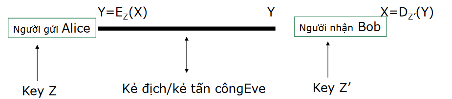

# Các khái niệm chung về an toàn thông tin

Bài viết  hiển thị các kiến thức cơ bản về ATTT.

<!--more-->
# Mục tiêu và nguyên tắc chung

- Đảm bảo tính mật (Confidentiality)
    - Đảm bảo tài sản không bị truy cập trái phép bởi những người không có thẩm quyền
- Đảm bảo tính nguyên vẹn (Integrity)
    - Đảm bảo tài sản không thể bị sửa đổi, làm giả bởi những người không có thẩm quyền
        - Tính nguyên vẹn của dữ liệu (Data integrity)
        - Tính nguyên vẹn của chủ thể (Origin integrity)
- Tính khả dụng (Availability)
    - Đảm bảo tài sản là sẵn sàng để đáp ứng cho người có thẩm  quyền

# Thế nào là Crypto ?

- Xây dựng và phân tích các giao thực mật mã để đạt được các mục tiêu về an toàn thông tin
- Một giao thức (hoặc một cơ chế) là một bộ các thủ tục cho biết các bên tham gia cần phải làm những gì
- Các nhà mật mã học phân tích các giao thức dưới các mô hình tấn công
    - Giả sử khả năng và các hành động có thể của kẻ tấn công
        - Chúng ta cần đứng trên vai trò của kẻ tấn công để suy nghĩ

# Các thuật ngữ

- Ngành Mật mã (cryptology) thường được quan niệm như sự kết hợp của hai lĩnh vực con:
    - Phá giải mã (cryptanalysis): nghiên cứu các kỹ thuật toán học phục vụ phân tích phá mật mã và/hoặc tạo ra các đoạn mã giản nhằm đánh lừa bên nhận tin.
    - Sinh, chế mã mật (cryptography): nghiên cứu các kỹ thuật toán học nhằm
cung cấp các công cụ hay dịch vụ đảm bảo an toàn thông tin.

Hai lĩnh vực con này tồn tại như hai mặt đối lập, “đấu tranh để cùng phát triển” của một thể thống nhất là ngành khoa học mật mã (cryptology). Tuy nhiên, do lĩnh vực thứ hai (cryptanalysis) ít được phổ biến quảng đại nên dần dần, cách hiểu chung hiện
nay là đánh đồng hai thuật ngữ cryptography và cryptology. Theo thói quen chung này, hai thuật ngữ này có thể dùng thay thế nhau. Thậm chí cryptography là thuật ngữ ưa dùng, phổ biến trong mọi sách vở phổ biến khoa học, còn cryptology thì xuất hiện
trong một phạm vi hẹp của các nhà nghiên cứu học thuật thuần túy.

- Plaintexts: bản rõ
- Ciphertexts: bản mã
- Keys: khoá
- Encryption: mã hoá 
- Decryption: giải mã


graph TD

    A[Bản rõ] ---> B[Mã hóa]

    B -- Bản mã --> C[Giải mã]

    C --> D[Bản rõ]

    E[Khóa] ---> B & C
    



# Hệ thống mã hóa

- \\(P\\) là tập hữu hạn các bản rõ (PlainText), nó được gọi là không gian bản rõ chứa bản tin gốc ban đầu.
- \\(C\\) là tập hợp hữu hạn bản mã (Crypto), nó còn được gọi là không gian các bản mã. Một phần tử của \\(C\\) có thể nhận được bằng cách áp dụng phép mã hóa \\(E_K\\) lên một phần tử P, với \\(k \in K\\).
- \\(K\\) là tập hữu hạn các khoá hay còn gọi là không gian khoá. Đối với mỗi phần tử k của K được gọi là một khoá (Key). Số lượng của không gian khoá phải đủ lớn để “kẻ địch” không có đủ thời gian thử mọi khoá có thể (phương pháp vét cạn).

Là bộ năm $\mathbb{P}, \mathbb{C}, \mathbb{K}, \mathbb{E}, \mathbb{D}$ thỏa mãn các điều kiện sau:

- Tập nguồn $ \mathbb{P} $ là tập hữu hạn các mẩu tin nguồn cần mã hóa có thể có
- Tập đích $ \mathbb{C} $ là tập hữu hạn các mẩu tin có thể có sau khi mã hóa
- Tập khóa $ \mathbb{K} $ là tập hữu hạn các khóa có thể được sử dụng
- Tập $ \mathbb{E} $ và $ \mathbb{D} $ là tập luật mã hóa và giải mã. $ \forall k \in \mathbb{K}: \exists e_k \in \mathbb{E}, \exists d_k \in \mathbb{D}$ sao cho:
    - Luật mã hóa: $e_k: \mathbb{P} \rightarrow \mathbb{C}$
    - Luật giải mã: $d_k: \mathbb{C} \rightarrow \mathbb{P}$
  
  2 luật này thỏa mãn $d_k(e_k(x)) = x, \forall x \in \mathbb{P}$

- **Bảo đảm mẩu tin $x$ được mã hóa bằng luật $e_k$ có thể được giải mã bằng luật $d_k$**

# Mật mã khoá bí mật: Secret-key cryptography
- Còn có tên là: mật mã khoá đối xứng -- symmetric cryptography
- Quá trình mã hoá và giải mã dùng cùng một khoá (Z=Z’) $\Rightarrow$ mật mã khoá đối xứng
- Khoá cần phải giữ bí mật $\Rightarrow$ mật mã khoá bí mật
- Vấn đề phân phối khoá: làm sao để chia sẻ khoá giữa A và B

# Mật mã khoá công khai: Public-key cryptography
- Còn gọi là: mật mã khoá phi đối xứng -- asymmetric cryptography
- Khoá dùng để mã hoá và giải mã là khác nhau
    - Không thể suy ra khoá giải mã từ khoá dùng để mã hoá và ngược lại
- Tốn chi phí hơn khoá đối xứng

## So sánh hệ mã đối xứng và bất đối xứng

|Nội dung|Mã hóa đối xứng|Mã hóa bất đối xứng|
|--------|---------------|-------------------|
|Tốc độ|Nhanh|Chậm|
|Chiều dài khóa|Ngắn|Dài|
|Trao đổi mã khóa|Khó|Dễ|
|Tên gọi khóa|Secret key|Public-private key|

## Làm sao để ta có thể đánh giá được tính an toàn, hay tính bảo mật của mỗi một hệ mã đặt ra?
- Một hệ mã mật là không an toàn (insecure)
    - Bằng việc chỉ ra cách phá nó trong một mô hình tấn công (các mục tiêu về ATBM (security) không được đảm bảo đúng)
- Để có thể khẳng định tính an toàn cao
    - Đưa ra một chứng minh hình thức (formal proof)
        - Chứng minh bằng công cụ toán học là tính ATBM của hệ mã đang xét là tương đương với một hệ mã kinh điển, mà tính an toàn của nó đã khẳng định rộng rãi từ lâu.

# Phá mã
- Có rất nhiều kiểu tấn công, phụ thuộc vào:
    - Kiểu thông tin mà kẻ tấn công có thể có
    - Tương tác với máy mã hoá
    - Năng lực tính toán của kẻ tấn công
- Tấn công chỉ dựa vào bản mã (Ciphertext-only attack):
    - Kẻ tấn công chỉ biết bản mã
    - Mục tiêu: tìm được bản rõ và khoá
    - Chú ý: một hệ thống bị tấn công bởi kiểu tấn công này thì hoàn toàn không an toàn
- Tấn công dựa vào bản rõ (Known-plaintext attack):
    - Kẻ tấn công biết một vài bản mã và các bản rõ tương ứng
    - Mục tiêu: tìm ra khoá đã được dùng để mã hoá
    - Hoặc tìm ra cách để giải mã các gói tin dùng cùng khoá với
các gói tin đã bắt được
- Tấn công bản rõ có chọn lựa (Chosen-plaintext attack)
    - Kẻ tấn công có thể chọn một số các bản rõ và nhận được các bản mã tương ứng
    - Mục tiêu: suy đoán khoá
    - Tấn công bản mã có chọn lựa (Chosen-ciphertext attack)
    - Tương tự như trên nhưng kẻ tân công có thể chọn một vài bản mã và nhận được các bản rõ tương ứng.
    - Sự lựa chọn của bản mã có thể thay đổi tuỳ vào bản rõ nhận được trước đó.

# Mô hình đánh giá mức độ bảo mật
- Bảo mật vô điều kiện (unconditional security): Đây là mô hình đánh giá ATBM mức cao nhất, trong đó “vô điều kiện” được hiểu theo ý nghĩa của lý thuyết thông tin (information theory), trong đó các ý niệm về “lượng tin” được hình thức hóa thông qua các phép toán xác suất. Trong mô hình này, kẻ địch được coi là không bị hạn chế về năng lực tính toán, tức là có thể thực hiện bất kỳ khối lượng tính toán cực lớn nào đặt ra trong khoảng thời gian ngắn bất kỳ. Mặc dù có năng lực tính toán siêu nhiên như vậy, mô hình này chỉ giả thiết kẻ tấn công là người ngoài hoàn toàn (tức là ứng với mô hình tấn công chỉ–biết–bản–mã). Một hệ mật mã đạt được mức an toàn vô điều kiện,
tức là có thể đứng vững trước sức mạnh của một kẻ địch bên ngoài (chỉ biết bản mã) có khả năng không hạn chế tính toán, được gọi là đạt đến bí mật tuyệt đối (perfect secretcy).
- Bảo mật chứng minh được (provable security): Đây cũng là một mô hình đánh giá mức rất cao, lý tưởng trong hầu hết các trường hợp. Một hệ mật mã đạt được mức đánh giá này đối với một mô hình tấn công cụ thể nào đó, nếu ta có thể chứng minh bằng toán học rằng tính an toàn của hệ mật là được quy về tính NP–khó của một bài toán nào đó đã được biết từ lâu (ví dụ bài toán phân tích ra thừa số nguyên tố, bài toán cái túi, bài toán tính logarit rời rạc...). Nói cách khác, ta phải chứng minh được là kẻ thù muốn phá được hệ mã thì phải thực hiện một khối lượng tính toán tương đương hoặc hơn với việc giải quyết một bài toán NP–khó đã biết.
- Bảo mật tính toán được, hay bảo mật thực tiễn (computational security hay practical security): Đây là một trong những mức đánh giá thường được áp dụng nhất trong thực tế (khi những mức bảo mật cao hơn được cho là không thể đạt tới). Khi đánh giá ở mức này với một hệ mã cụ thể, người ta lượng hóa khối lượng tính toán đặt ra để có thể phá hệ mã này, sử dụng kiểu tấn công mạnh nhất đã biết (thường kèm theo đó là mô hình tấn công phổ biến mạnh nhất). Từ việc đánh giá được khối lượng tính toán này cùng thời gian thực hiện (với năng lực kẻ địch mạnh nhất có thể trên thực tế), và so sánh với thời gian đòi hỏi đảm bảo tính mật trên thực tế, ta có thể đánh giá hệ mã có đạt an toàn thực tiễn cao hay không. Đôi khi, cơ sở đánh giá cũng dựa vào một bài toán khó nào đó mặc dù không đưa ra được một chứng minh tương đương thực sự.

Ví dụ: Giả thiết một hệ mã X được sử dụng mã mật các loại văn bản hợp đồng có giá trị sử dụng trong 2 năm. Nếu như kẻ địch có năng lực tính toán mạnh nhất có thể cũng phải mất thời gian đến 20 năm để phá được (chẳng hạn sử dụng toàn bộ lực lượng tính toán của các công ty IT lớn như Microsoft hay Google), hệ mã X này có thể được đánh giá là đảm bảo mức an toàn thực tiễn.

- Bảo mật tự tác (ad hoc security): Một số hệ mật mã riêng được một số công ty hoặc cá nhân tự chế để phục vụ mục đích đặc biệt dùng nội bộ. Tác giả loại hệ mật mã có thể sử dụng những lập luận đánh giá hợp lý nhất định dựa trên việc ước đoán khối lượng tính toán của kẻ địch khi sử dụng những tấn công mạnh nhất đã biết và lập luận về tính bất khả thi thực tiễn để thực hiện. Mặc dù vậy hệ mật mã này vẫn có thể bị phá bởi những tấn công có thể tồn tại mà chưa được biết tới đến thời điểm đó; vì vậy, thực tế bảo mật ở mức này hàm nghĩa không có một chứng minh đảm bảo thực sự, nên không thể coi là tin cậy với đại chúng.

# Các nguồn tham khảo
- Slide: Thầy Nguyễn Khanh Văn
- https://nam.name.vn/bai-1-gioi-thieu-ve-an-toan-va-bao-mat-thong-tin.html

## Tính chất của $\mathbb{Z}_m$
### Phép cộng trong $\mathbb{Z}_m$
- $\forall a, b \in \mathbb{Z}_m: a + b \in \mathbb{Z}_m$
- Giao hoán: $\forall a, b \in \mathbb{Z}_m: a + b = b + a$
- Kết hợp: $\forall a, b, c \in \mathbb{Z}_m: (a + b) + c = a + (b + c)$
- Phần tử trung hòa là $0$, $\forall a \in \mathbb{Z}_m: a + 0 = 0 + a = a$
- Phần tử đối: $\forall a, b \in \mathbb{Z}_m$ đều có phần tử đối là $(m - a) \in \mathbb{Z}_m$

### Phép nhân trong $\mathbb{Z}_m$
- $\forall a, b \in \mathbb{Z}_m: a \times b \in \mathbb{Z}_m$
- Giao hoán: $\forall a, b \in \mathbb{Z}_m: a \times b = b \times a$
- Kết hợp: $\forall a, b, c \in \mathbb{Z}_m: (a \times b) \times c = a \times (b \times c)$
- Phần tử đơn vị là $1$, $\forall a \in \mathbb{Z}_m: a \times 1 = 1 \times a = a$
- Phân phối phép $\times$ với phép $+$: $\forall a, b, c \in \mathbb{Z}_m, (a + b) \times c = a\times c + b\times c$

