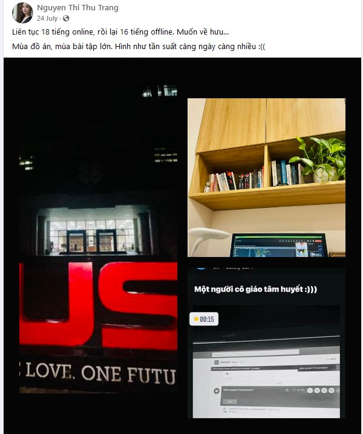

# A Nightmare Sunday in My Life

This article shows my feelings when studying at HUST.

<!--more-->

# Introduction

## Overview

As you may or may not know, HUST is a university with many excellent professors. But I have to admit, none of them work at full capacity as terrifyingly as she does.

### Developments

When I had to present the OOPs miniproject on July 24, 2023, people with their names listed last, like me, always felt very stressed and nervous. Why? Because Ms.Trang said each group should present for 20 minutes, but in reality, the first few groups had many questions and took an average of 1 hour for each group. There were a total of 23 groups! So I also guessed that I would only have my turn to present at around midnight on Monday, and that's exactly what happened.

*Source:* [Cô Trang](https://www.facebook.com/trangntt.it/posts/pfbid02gcKc9PKAJg47RkQW2b7hGGEEqTqU3VchwYcyiYf2i8fuADjmFQqcDgxKYDJhSSJjl)

*Source:* [Người nghiện Hút](https://www.facebook.com/aidsk66bk/posts/pfbid0GAEFtxynrjwwNmqkScxjo7BZqAnsaJ1sBF5DafmPj7qsinxaKRqs65n2eAsZHhYyl)

She also asked the last few groups if they needed to postpone our presentations to the next evening. I thought that would be terrible because at the moment, I still had some other miniprojects and a challenging final exam ahead. Of course, none of us wanted her to continue either because, at that time, it was already 9 pm, and she hadn't even had dinner. However, for our own benefit, we naturally declined that idea, and we speedran until 1 am the next morning. She and all the students were able to complete the presentations for all 23 groups. (Is the peak of success achieved by sacrificing so much?)
