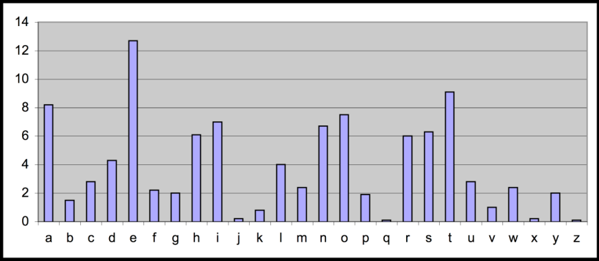

# Cơ sở mật mã học

This article shows the concept of Cryptography and Security.

<!--more-->

# Mật mã khối DES

## 1. Một số hệ mật mã cổ điển

### 1.1 Mã dịch shift cipher (mã cộng additive cipher)

- Không gian khóa : [1...25]

- Mẫ hóa với khóa K cho trước: 
    - Mỗi ký tự của bản rõ P được mã hóa thành ký tự thứ k sau nó (dịch đi K bước về phía bên phải)
    - Cách định nghĩa khác: \\(Y = X \oplus K \Rightarrow\\) mã cộng
- Giải mã với khóa K cho trước
    - Dịch trái

| A | B | C | D | E | F | G | H | I | J | K  | L  | M  | N  | O  | P  | Q  | R  | S  | T  | U  | V  | W  | X  | Y  | Z  |
|---|---|---|---|---|---|---|---|---|---|----|----|----|----|----|----|----|----|----|----|----|----|----|----|----|----|
| 0 | 1 | 2 | 3 | 4 | 5 | 6 | 7 | 8 | 9 | 10 | 11 | 12 | 13 | 14 | 15 | 16 | 17 | 18 | 19 | 20 | 21 | 22 | 23 | 24 | 25 |

Y = (X + K) mod 26

X = (Y - K) mod 26

P = CRYPTOGRAPHYISFUN

K = 11

C = NCJAVZRCLASJTDQFY

Ví dụ
- Tìm rõ những bản mã sau: 
    - A B C D E F G H I J K L M N O P Q R S T U V W X Y Z
    - Djqifs jt csplfo
    - Cipher is broken

Mã dịch: phá mã
- Duyệt toàn bộ
    - Không gian khoá nhỏ (<= 26 khoá).
    - Tìm được K \\(\Rightarrow\\) giải mã dễ dàng

### 1.2 Mật mã bảng thay thế (Monoalphabetic cipher)

- Không gian khoá: Toàn bộ hoán vị của bảng chữ cái \\(\sum = {A, B, C, ..., Z}\\)

- Mã khóa với khóa \\(\pi\\) cho trước: 
    - Mỗi ký tự X trong bản rõ P được thay thế bởi ký tự \\(\pi(X)\\) tương ứng trong hoán vị \\(\pi\\)
- Giải mã với khóa \\(\pi\\) cho trước: 
    - Mỗi ký tự Y trong bản mã C được thay thế bởi ký tự \\(\pi^{-1}(X)\\) tương ứng trong hoán vị \\(\pi^{-1}\\)

- Example: 

        A B C D E F G H I J K L M N O P Q R S T U V W X Y Z
    \\(\pi\\) = B A D C Z H W Y G O Q X S V T R N M S K J I P F E U

BECAUSE \\(\Rightarrow\\) AZDBJSZ

#### Có vẻ an toàn
- Phương pháp duyệt toàn bộ là bất khả thi
    - Không gian khóa lớn: \\(26! \approx 4.10^26\\)

- Được sử dụng phổ biến ở thiên niên kỷ thứ nhất trước công nguyên
- Đã từng được cho là không thể phá được

Trong thời kỳ thiên nhiên kỷ đầu tiên (trước năm 1000), mật mã một bảng thế được coi là không thể phá được. Tuy nhiên sau đó, các nhà nghiên cứu thời đó đã dần dần tìm ra phương pháp phá giải tốt hơn việc thử vét cạn không gian khóa; phương pháp này dựa trên những quan sát mang tính thống kê, chẳng hạn về sự xuất hiện không đồng đều của các chữ cái trong ngôn ngữ tự nhiên. 

### Phá mã một bảng thế

- Ví dụ: 
    - Bản mã: uxwk lakkvma xvk naac vuuvbdap vcp uxwk wk kwliya
    - Biết số các ký t các ký tự trong b trong bản rõ là:
        - a: 5, b:1, c:1 d:2, e:6, g:1, h:3, i:4, k:1, l:1, m:2, n:2, p:1, s:7, t:4, các ký tự còn lại không xuất hiện
    - Hãy tìm bản rõ ? 

### Phá mã một bảng thế: phân tích tần số xuất hiện của các ký tự
- Mỗi ngôn ngữ đều có đặc trưng:
    - Tần số xuất hiện của các ký tự, của một nhóm 2 hay nhiều ký tự.

- Mã thế duy trì đặc trưng trên \\(\Rightarrow\\) có nguy cơ bị tấn công bằng cách phân tích tần số xuất hiện của các ký tự 

### Mã thế: phá mã

