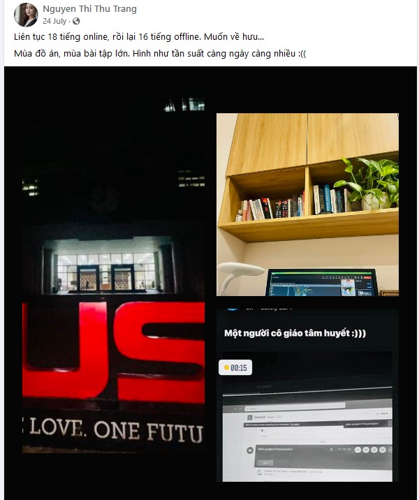

# Một ngày Chủ Nhật ác mộng nhất trong cuộc đời tôi

# Mở đầu

## Khái quát

Như các bạn đã biết (hoặc không), HUST là một ngôi trường có nhiều thầy cô giỏi, nhưng phải thú thật và thừa nhận với các bạn rằng tôi chưa thấy cô nào lại có thể làm việc hết công suất của mình một cách kinh khủng như vậy. 

### Diễn biến

Khi phải thuyết trình miniproject OOPs vào ngày 24/7/2023, những người có thứ tự tên đứng ở danh sách cuối như tôi luôn cảm thấy rất căng thẳng và hồi hộp. Vì sao ??? Vì cô Trang bảo mỗi nhóm thuyết trình 20 phút nhưng thực tế những nhóm đầu cô hỏi rất nhiều và lên đến tận trung bình 1 tiếng cho mỗi nhóm, và tổng cộng có 23 nhóm cơ @@ (tôi ở nhóm 22). Thế nên tôi cũng đã đoán sơ sơ chắc 0h sáng ngày thứ 2 mới đến lược mình thuyết trình thật, và đúng là như vậy.

*Source:* [Cô Trang](https://www.facebook.com/trangntt.it/posts/pfbid02gcKc9PKAJg47RkQW2b7hGGEEqTqU3VchwYcyiYf2i8fuADjmFQqcDgxKYDJhSSJjl)

*Source:* [Người nghiện Hút](https://www.facebook.com/aidsk66bk/posts/pfbid0GAEFtxynrjwwNmqkScxjo7BZqAnsaJ1sBF5DafmPj7qsinxaKRqs65n2eAsZHhYyl)

Cô cũng đã hỏi những nhóm cuối rằng liệu có cần hoãn cho bọn tôi sang tối mai được không (tôi nghĩ điều đó thật tồi tệ vì trước mắt tôi còn một ít miniproject khác và kì thi cuối kỳ đầy cam go và thử thách sắp tới, tất nhiên bọn tôi cũng không muốn cô làm tiếp vì nói thật lúc đó 9h tối và cô còn chưa còn ăn tối). Nhưng vì lợi ích của bản thân, nên tất nhiên chúng tôi đã từ chối ý kiến đó và speedrun cho đến 1h sáng hôm sau cả cô và các trò đều xong 23 nhóm (Liệu thành công của đỉnh cao là phải đánh đổi nhiều thứ ????)
